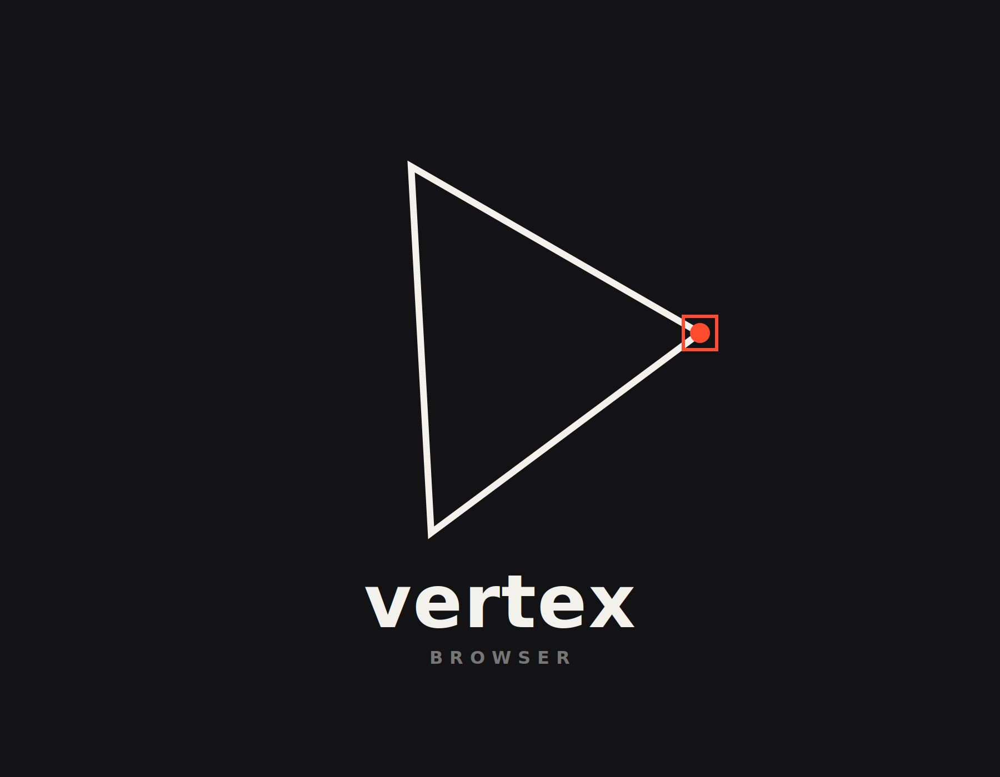

# Vertex

<p align="center">
  
</p>

<p align="center">
  <a href="https://github.com/hackclubium/Vertex/releases"></a>
  <a href="https://github.com/hackclubium/Vertex/actions/workflows/release.yml"></a>
  
  
</p>

<p align="center">
  <strong>A browser engine built from scratch in C++.</strong><br>
  HTML, CSS, JavaScript, layout, SVG, painting, navigation, and tabs —
  no Chromium, WebView, CEF, or QtWebEngine.
</p>

---

Vertex is a web browser built entirely from the ground up. Every piece — parser, DOM,
stylesheet engine, JavaScript runtime, layout algorithms, SVG renderer, painting path,
resource cache, forms, events, history, and the native window shell — lives in this
repository.

If you want to understand how a browser actually works, Vertex is the kind of project
you can open, read, and tinker with.

Comments in the codebase are intentionally detailed to aid readability.

## Status

Vertex loads real pages and has enough of the platform to be useful as an everyday
experimental browser:

| Area | Status |
|---|---|
| Platforms | Windows, macOS, and Linux native shells over one shared engine |
| Pages | HTTP/HTTPS pages, images, CSS, scripts, SVGs, and local `vertex://` pages |
| UI | Tabs, address bar, profile-backed history/bookmarks/downloads, reload/stop/home, zoom, find-in-page, status text |
| Updates | GitHub release checking, background portable download, helper-assisted install with `F12` |
| Performance | Cached resources, cached stylesheets, cached selector parsing, dirty layout paths, hover fast paths |
| Profile | Per-user storage for settings, history, bookmarks, downloads, cookies, local storage, and session restore |
| Testing | Subsystem test suites for HTML, CSS, layout, paint, JS, and network |

It is still early. Some pages will look wrong, some JavaScript will hit unimplemented
APIs, and layout is still growing. Each broken page drives new engine work.

## Architecture

Vertex is a portable engine with thin per-platform shells:

```text
          native shell
   Windows / macOS / Linux
              |
              v
        BrowserChrome
 tabs, navigation, URL state, updater
              |
              v
   HTML -> DOM -> CSS cascade -> layout tree -> paint
              |
              v
       JS runtime + DOM bridge
```

The platform layer handles windows, input, and pixels. The engine owns parsing, DOM,
style resolution, layout, scripting, and painting.

### Built Here

- **HTML** — tokenizer and parser with entity handling, auto-close, rawtext/RCDATA
  modes, and real-world error recovery.
- **CSS** — cascade with combinators, attributes, pseudo-classes, relational selectors
  (`:has()`, `:nth-child(... of selector)`), media/supports queries, custom properties,
  logical properties, transforms, gradients, flex, grid, tables, floats, positioning,
  form styling, and viewport/math functions.
- **JavaScript** — lexer, parser, compiler, VM, DOM bindings, timers, events, promises,
  `fetch`, a hand-rolled WebSocket client (handshake, framing, and masking from scratch
  — curl is only the encrypted byte pipe for `wss://`), storage, DOM selectors,
  geometry APIs, and observer APIs.
- **Layout** — block, inline, line boxes, floats, tables, flex, grid, replaced elements,
  positioned boxes, scrolling, and dirty-layout invalidation.
- **SVG** — inline and external SVGs, paths, gradients, transforms, text, symbols,
  `<use>`, class/style rules, stroke/fill behavior, and raster fallback.
- **Painting** — text, boxes, links, images, controls, SVG, hover, focus, dirty
  regions, and cached rendering paths with hit testing.

### External Dependencies

Vertex depends on a few libraries that don't supply browser behavior, only low-level
transport, decoding, and platform drawing:

| Dependency | Purpose |
|---|---|
| libcurl | HTTP/HTTPS |
| stb\_image | PNG/JPEG/etc. decoding |
| Direct2D / DirectWrite | Windows pixels and glyphs |
| Core Graphics / Core Text | macOS pixels and glyphs |

Linux has none — windowing (XCB), 2D rendering, text, and `<canvas>` are all
hand-rolled, no GTK/Cairo/Pango/fontconfig.

## Download

Prebuilt releases: [github.com/hackclubium/Vertex/releases](https://github.com/hackclubium/Vertex/releases)

| Platform | Installer |
|---|---|
| Windows | `Vertex-windows-installer.exe` |
| macOS | `Vertex-macos-installer.dmg` |
| Linux | `Vertex-linux-installer.tar.gz` |

Portable updater binaries are also included in each release. Vertex checks for new
GitHub releases on startup. Press `F12` to install an update — it launches
`VertexUpdater`, swaps the portable binary, and restarts.

## Profile Data

Profile and cache folders are created on first launch:

| Platform | Profile | Cache |
|---|---|---|
| Windows | `%LOCALAPPDATA%\Vertex\User Data\Default` | `%LOCALAPPDATA%\Vertex\Cache\Default` |
| macOS | `~/Library/Application Support/Vertex/Default` | `~/Library/Caches/Vertex/Default` |
| Linux | `~/.config/Vertex/Default` | `~/.cache/Vertex/Default` |

Profile files include `history.tsv`, `bookmarks.tsv`, `downloads.tsv`, `settings.json`,
`cookies.tsv`, `local_storage/`, and `session_restore.json`. Internal pages at
`vertex://settings`, `vertex://site-data`, `vertex://history`, `vertex://bookmarks`,
and `vertex://downloads` expose this data inside the browser.

## Build

CMake and C++17. The version is derived from the latest git tag.

### Windows

Requires Visual Studio Build Tools with the x64 C++ toolchain.

```bat
build.bat
build\Release\Vertex.exe
```

### macOS

Requires Xcode command line tools.

```sh
cmake -B build
cmake --build build
open build/Vertex.app
```

### Linux

Requires only XCB development headers. No GTK, Cairo, Pango, or fontconfig — Vertex
does its own windowing, rasterizing, text rendering, and `<canvas>` on Linux.

```sh
sudo apt-get install -y build-essential cmake libxcb1-dev libcurl4-openssl-dev pkg-config
cmake -B build
cmake --build build
./build/Vertex
```

## Controls

| Shortcut | Action |
|---|---|
| `Ctrl+L` | Focus the address bar |
| `Ctrl+T` / `Ctrl+W` | New tab / close tab |
| `Ctrl+R` or `F5` | Reload |
| `Ctrl+F` | Find in page |
| `Ctrl+G` / `Ctrl+Shift+G` | Next / previous match |
| `Ctrl++` / `Ctrl+-` | Zoom in / out |
| `Alt+Left` / `Alt+Right` | Back / forward |
| `F12` | Install a downloaded update |

## Tests

Tests are split by subsystem:

```bat
build\Release\vertex-tests.exe html
build\Release\vertex-tests.exe css
build\Release\vertex-tests.exe layout
build\Release\vertex-tests.exe paint
build\Release\vertex-tests.exe js
build\Release\vertex-tests.exe network
build\Release\vertex-layout-engine-tests.exe
```

Offline debugging tools:

```sh
build/dump_layout page.html [viewportWidth]
build/dump_js script.js
```

`dump_layout` prints the box tree and geometry — useful when a real site breaks and
you want a focused regression test instead of guessing from screenshots.

## Performance Debugging

Set `VERTEX_PERF=1` before launching to print per-page timing counters:

```sh
VERTEX_PERF=1 ./build/Vertex
```

On Windows:

```bat
set VERTEX_PERF=1
build\Release\Vertex.exe
```

The log covers fetch time, resource requests and cache hits, style time, layout time,
paint time, JavaScript parse/run time, and whether layout was reused.

## Fixing the Web, One Page at a Time

Vertex grows by turning real web failures into engine improvements:

1. Capture (or reduce) the page that breaks.
2. Identify the subsystem — HTML, CSS, JS, layout, paint, network, or platform.
3. Add the smallest test that reproduces the issue.
4. Fix the engine.
5. Keep the test.

Wikipedia has been the main stress test because it exercises the kinds of modern-web
details that small browsers usually skip: ResourceLoader scripts, dense CSS, logical
properties, SVG sprites, form controls, floats, positioned elements, selectors,
events, history, scrolling, and reused resources.

## Project Layout

```text
src/
  css/          stylesheet parsing, cascade, computed style
  html/         tokenizer, parser, embedded resources
  js/           lexer, compiler, VM, runtime, DOM bridge
  layout/       box tree and layout engine
  network/      fetcher, URL handling, cache, text decoding
  paint/        display-list pieces
  platform/     native shells and shared browser chrome
  render/       painting, SVG, images, fonts
  test/         subsystem and regression tests
tools/
  dump_layout   offline layout inspection
  dump_js       offline JS execution
```

## Why Vertex Exists

Browsers are treated like black boxes — too large, too tangled, too industrial to
approach.

Vertex is the opposite. A browser can start small, stay readable, and still become
real by accumulating correct behavior in public. Every feature is an invitation to
understand one more piece of the web.
